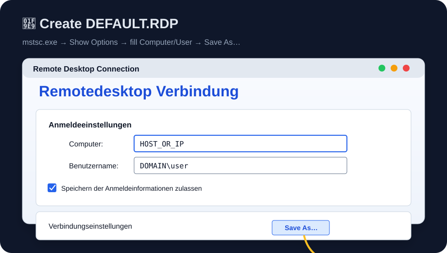

# 🔐 RDPsign PowerShell

> ✨ Compact PowerShell workflow to create **trusted, signed `.rdp` files** for Windows Remote Desktop.

`RDPsign-powershell` removes the noisy **“Unknown publisher”** prompt by signing `.rdp` files with `rdpsign.exe` and installing the required publisher trust on the target/opening machine. It can also trust the Remote Desktop TLS certificate to avoid the **“identity of the remote computer cannot be verified”** warning.

---

## ⚡ How to start

1. 🧩 Create `DEFAULT.RDP` from the Remote Desktop UI:

   

   ```text
   mstsc.exe → Show Options → enter Computer + User name → Save As… → Desktop\DEFAULT.RDP
   ```

2. ✍️ On the signing machine, create/export certs + sign the output RDP:
   ```powershell
   .\01-NewAndSign-Rdp.ps1 `
     -HostName "HOST_OR_IP" `
     -UserName "DOMAIN\user" `
     -InputRdpPath "$env:USERPROFILE\Desktop\DEFAULT.RDP" `
     -OutputRdpPath "$env:USERPROFILE\Desktop\RDP HOST_OR_IP.RDP"
   ```

3. 📦 Copy to the target/opening machine:
   ```text
   RDP HOST_OR_IP.RDP
   RDP HOST_OR_IP.cer
   RDP-TLS-HOST_OR_IP.cer   # optional, for remote computer identity trust
   ```

4. 🛡️ On the target/opening machine, install trust:
   ```powershell
   .\02-Trust-RdpPublisher.ps1 `
     -RdpPath "$env:USERPROFILE\Desktop\RDP HOST_OR_IP.RDP" `
     -CerPath "$env:USERPROFILE\Desktop\RDP HOST_OR_IP.cer" `
     -RemoteDesktopCerPath "$env:USERPROFILE\Desktop\RDP-TLS-HOST_OR_IP.cer" `
     -ExpectedHostName "HOST_OR_IP" `
     -ExpectedUserName "DOMAIN\user" `
     -RunRdpSignListTest
   ```

5. 🚀 Start the signed connection:
   ```powershell
   mstsc.exe "$env:USERPROFILE\Desktop\RDP HOST_OR_IP.RDP"
   ```

---

## 👤 Username format

Use the **same username value** in Script #1 and Script #2.

| Login type | Format | Example |
|---|---|---|
| 🌐 Domain / AD user | `DOMAIN\user` | `ACME\alex` |
| 🖥️ Local user on remote host | `\user` | `\alex` |
| 🧩 Explicit local style | `.\user` | `.\alex` |

> ℹ️ In PowerShell strings, `\` is just a normal backslash. No escaping required.

---

## 🧠 What it does

| Script | Purpose |
|---|---|
| `01-NewAndSign-Rdp.ps1` | Creates/reuses signing cert, exports `.cer`/`.pfx`, builds output `.rdp`, signs it, verifies signature structure |
| `02-Trust-RdpPublisher.ps1` | Imports publisher cert, adds RDP publisher trust, optionally trusts the remote host TLS cert |

---

## 🧾 Script docs

Both scripts use PowerShell **comment-based help** (`.SYNOPSIS`, `.DESCRIPTION`, `.PARAMETER`, `.EXAMPLE`, `.OUTPUTS`, `.NOTES`) plus compact phase comments (`# ✦ ...`) so humans and AI agents can quickly infer intent, side effects, and safe execution order.

```powershell
Get-Help .\01-NewAndSign-Rdp.ps1 -Detailed
Get-Help .\02-Trust-RdpPublisher.ps1 -Detailed
```

---

## 🔒 Security notes

- ✅ Copy `.rdp` + `.cer` to clients.
- 🚫 Do **not** copy/import `.pfx` to trust-only clients.
- 🔑 `.pfx` contains the private key and is only needed where signing should happen.
- 🧼 Re-run Script #1 after every `.rdp` change, because edits invalidate the signature.

---

## 🛠️ Requirements

- Windows 10/11 or Windows Server
- PowerShell as Administrator
- `rdpsign.exe` available in Windows
- Local admin rights for `LocalMachine` certificate/policy changes

---

## ✅ Result

A clean `.rdp` launch flow:

```text
signed .rdp ✅  trusted publisher ✅  optional trusted remote TLS cert ✅
```
